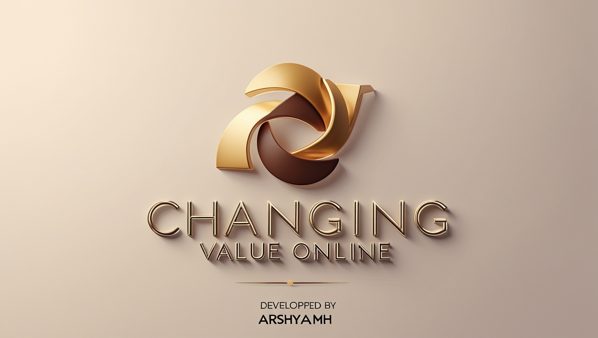

# ValuShift 🌐

ValuShift is a dynamic web platform that represents the concept of changing value online. Built with HTML, CSS, and JavaScript, this project features smooth animations and seamless transitions to offer a smooth user experience for digital value exchange.



## Created By
This project was created by Arshiya Mh.

## Features ✨
- **Dynamic Value Exchange**: Represents the flow of changing value with smooth animations 🔄.
- **Sleek and Modern Design**: A minimal, futuristic look with vibrant colors to enhance the user experience 🎨.
- **Seamless User Experience**: Fluid transitions and an intuitive interface for easy navigation ⚡.
- **Desktop Design**: Optimized for desktop use with a responsive approach 💻.

## Installation 🛠️
To view or contribute to this project, follow these steps:

1. **Clone the repository**:

    ```bash
    git clone https://github.com/arshiya-mh/valu-shift.git
    ```

2. **Navigate into the project folder**:

    ```bash
    cd valu-shift
    ```

3. **Open the index.html file** in your browser to view the project.

## Live Demo 🌍
You can view the live demo of the project here: [ValuShift Live Demo](https://arshiya-mh.github.io/ValuShift/)

## Technologies Used 🔧
- **HTML**: Markup language used to structure the content 📝.
- **CSS**: Styling language for designing the layout and theme 🎨.
- **JavaScript**: Used for animations, transitions, and interactivity ⚡.

## Future Updates 🔮
- **Mobile Responsiveness**: Plans to add mobile responsiveness for better accessibility 📱.
- **Additional Features**: Adding more dynamic value exchange visualizations, advanced interactivity, and user customization options 🎛️.

---

**Developed by arshiya-mh**
